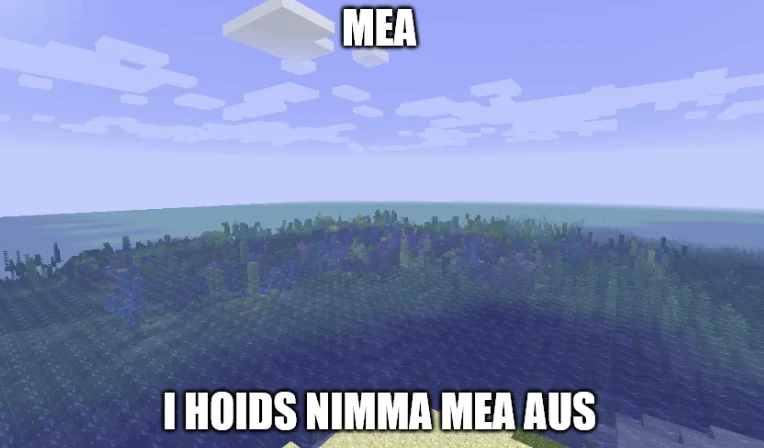
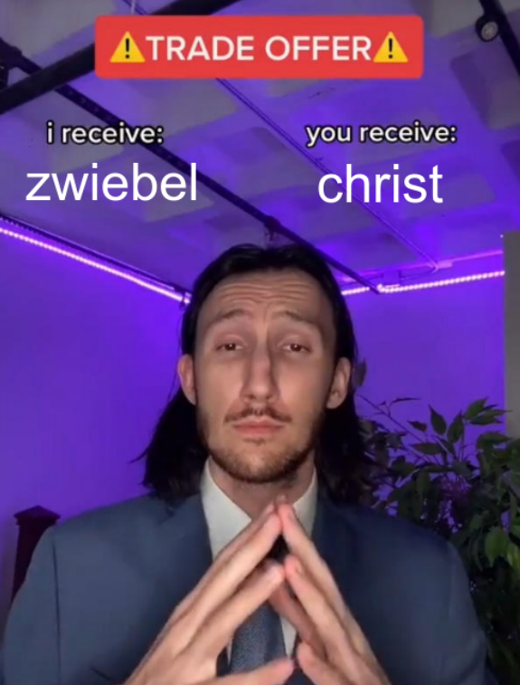
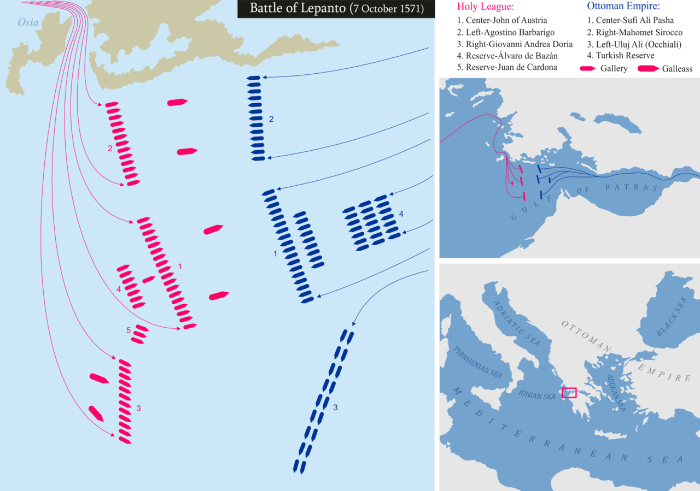

# Entscheidung im Mittelmeer
Jakob Hofer

---

## Hard Fax
- "Entscheidung im Mittelmeer: Europas Seekrieg gegen das Osmanische Reich 1521-1580"
- von Roger Crowley
- 320 Seiten
- Chronik

---

## Protagonisten
- Osmanen
    - später Republik Türkei
    - Großteil muslimisch
- Sultan (Herrscher der Osmanen)
    - Suleiman I
    - Selim II

---

## Protagonisten
- Christen
    - Großteil katholisch
- Päpste
    - Paul III
    - Paul IV
    - enorme Geldmassen
- Monarchen
    - Karl V
    - Philipp II

---

## Story - Prolog

- 29\. Mai 1453: Konstantinopel von Mehmet II eingenommen
    - später Hauptstadt Istanbul
- Mittelmeer ("Mittelpunkt der Erde") umkämpftes Gebiet
- \>100 jährige Schlach zwischen Islam (Osmanen) - Christentum (spanische Habsburger)
    - Balkan, ungarische Ebene, rotes Meer, vor den Toren Wiens

---

## Story
- Suleiman wird Sultan
- muss sich beweisen => Eroberungen

---

## Story - Übernahme von Rhodos
- Rhodos von Johaniter (Christen) überfallen
    - gefürchtete Ordensritter
- zentraler Punkt
    - Schiffe zwischen Ägypten und Istanbul abgefangen
- Suleiman verlautbart "Freundschaftsbekundung"
    - eigentlich Kriegserklärung
- L'Isle Adam (Großmeister von Rhodos) rüstet sich
- Christen gespalten (Martin Luther, interne Kriege)

---

## Story - auf Rhodos brodelts
- 200 000 Türken vs 500 Ritter
- 10\. Juni 1522 diplomatisches Schreiben
    - ergeben oder Krieg
- Upgrades für Rhodos vom Papst
    - auch Waffen vom dev branch

---

## Story - Ansturm auf Rhodos
- 24\. Juni: erster Belagerungsversuch
    - lange Vorbereitung, gut informiert dank Spionen
- 28\. Juli: Ankunft des Sultan
    - formeller Beginn der Belagerung
- Rampen mit Kanonen, Sprengungen unter der Mauer
- 10\. Oktober: große Sprengung - Anfang des Endes
- 20\. Dezember: Vertrag zur Übergabe
    - großzügig - Ritter dürfen einiges behalten und friedlich abziehen

---

## Story - Karli
- Karl V fällt großes Reich zu
- äußerlich weird aber ein intelligenter Herrscher
- besiegt direkt 1 / 2 gefürchteten Piraten
    - jüngerer Bruder Chaireddin aka "Barbarossa" überlebt
- 1529 Rückzug Suleimans aus Wien
    - erstes L seit 200 Jahren

---

## Story - Mr. Worldwide
- 1530: Vorstellung, Suleiman vs Karl sei weltweit
- Karl Probleme da Christentum gespalten
- dennoch Angst der Istanbuler
- Propaganda wichtig

---

## Story - Karl rasiert
- Karl gewinnt Festung Coron (Pylos, Griechenland)
- große Vergeltung
  - italienische Küste verwüstet, Schiffe verbrannt, Plünderungen
- 16\. August: Tunis (Afrika) kampflos übergeben
    - Sprungbrett für Angriffe
- Allgemein: Aktion => größere Gegenreaktion

---

## Story - Karl rasiert, pt. 2
- Karl attackiert Afrika
- 15\. Juni: Belagerung von La Goleta, Tunis wird angegriffen
- Sklavenaufstand => Barbarossa muss fliehen
- Rache der Rache => Plünderungen und Blutbad
- unglaublich blutrünstig

---

## Leseprobe
Seite 69

---

## Story - comebacc
- Anfang Oktober: kleiner Galeerenverband mit spanischen Fahnen
- Bewohner denken, Doria (hervorragender Admiral) zurückgekehrt
- nette Begrüßung
- Plot Twist: es ist Barbarossa - fällt ein

---

<video id="comeback" autoplay src="res/comeback.webm">

---

## Story - Mittelmeer als Hauptschauplatz

- Karl w/ Doria
  vs Suleiman w/ Barbarossa
- Frankreich beliefert Osmanen
- ab Mai 1537: Zerstörung der Adriaküste
- Venedig wird angegriffen
  - Verteidigungen halten stand

---

## Story - Mittelmeer als Hauptschauplatz pt. 2

- Winter 1537: Heilige Liga von Papst Paul III
  - Interessenskonflikte
- 28\. September: Osmanen greifen christliche Flotte an
  - Venezianer vorwärts
  - von Doria alleine gelassen
    - flieht

---

## Story - temporärer Frieden
- Geheimverhandlungen Karl & Doria und Barbarossa
- 1540 venezianischer Friedensvertrag mit Sultan

---

## Story - Karl geht all in

- 1541 Angriff auf Algier
- schlechtes Wetter, starke Verteidiger
- 155 Schiffe und 8 000 Mann verloren
- "in 1541 konnte man einen Christen für eine Zwiebel kaufen"

---

## Story - Chaos pur
- Karl am verlieren
- Schlachtzüge der Osmanen
- 1546 Tod von Barbarossa (80j)
- Überfälle, entführte Menschen, Erpressungen, Sklavenhandel, ...
- 1558 Tod von Karl
  - Sohn Philipp folgt
    - zu vorsichtig
    - viele unnötige Verluste

---

## Story - kalm

- Furcht vor Osmanen
- diese beschäftigt
  - Bürgerkrieg, Seuchen, Lebensmittelknappheit

---

## Story - Malta

- Malta (mit Ordensrittern) als Schlüsselpunkt
- Angriffsvorbereitungen der Osmanen
  - hastiger Verteidigungsaufbau

---

## Story - Kampf um Malta
- 500 Johaniter vs 7 000 Kombattanten
- Süden fällt schnell, Verteidiger entschlossen
  - gute Planung und Durchführung der Osmanen
- Überfall auf strategisches, schlecht gebautes Fort St. Elmo
- ewiges hin und her
- letztendlich Übernahme durch Osmanen

---

## Story - Kampf um Malta pt. 2
- Ablenkungsangriff -> übersehener Schützer macht 9er boat kill
- 4 000 Tode bei Osmanen
- (22\. Juli: 64 Geschütze zermürben 5 Tage lang Mauern)
- schier unendliche osmanische Kämpfer
- (plötzlicher Rückzug der osmanischen Armee - Reiter überfielen Lager)
- beträchtliches Schwächeln der beiden Seiten
  - "noch ein Angriff und Malta fällt"

---

## Story - Kampf um Malta pt. 3
- Entsatztruppe von Philipp
- hektischer Rückzug auf Schiffe
- frische Verstärkungstruppen drängen 10 000 Türken zurück
- dies letzter Angriff => Rückzug

---

## Story - se Aftermath
- 600 / 8 000 Verteidiger können noch Waffe tragen
- 250 / 500 Ritter tot
- alle KO
- groß gefeiert, dennoch nur kleiner Win für Christen
- Angst vor erneutem Angriff groß
- Osmanier mit anderen Feldzügen beschäftigt
- 5\. / 6\. September 1566: Tod von Suleiman
    - Selim II

---

## Story - es bleibt spannend...

- rund um 1566: Überleben wichtiger als Krieg
- Grundstein für Suezkanal
  - Seewag nach Westindien
- 1567 Aufstand Morisken
  - muslimisches Volk in Spanien

---

## Story - Chaos (schon wieder...)

- Osmanen wollen Zypern
- Venezianer unter Druck
- wollen heilige Alianz
  - gleichzeitig Verhandlung mit Türken
- Spanien abgeneigt
  - Venezianer = antimate
- Papst enthusiastisch

---

## Story - jz wirds schmerzhaft
- Philipp traut sich nix => später Aufbruch
- ungeeigneter Befehlshaber (Dandolo 😡)
  - Osmanen rücken mühelos vor
  - Zypern komplett rasiert
- Legion instabil
  - Venezueler geheime Verhandlungen mit Türken

---

## Story - Überaschung... oder auch nicht
- Famagusta = letztes Fort
- 25\. Mai: endlich heilige Liga
  - direkt wieder Komplikationen
- Verteidiger langsam aber sicher in Famagusta dezimiert
- langsamer Bau der spanischen Flotte
- 1\. August: Famagusta kapituliert
  - großzügige Bedingungen
  - (Streit um muslimische Sklaven)
    - (tot oder lebendig? im Vertrag oder nicht?)
    - Hinrichtung hoher Persoenlichkeiten der Venezianer

---

## Story - Schlacht von Lepanto

- heilige Liga endlich kampfbereit
- gegenseitige Unterschätzung
- 7\. Oktober 1571 Konfrontation
- Christen stiften Unordnung
- Osmanen starke Konter
  - fliehen an Land
- gegenseitige Enterungen
  - inklusive Flagschiffe
- Spanier erlangen "Sultana"
  - töten Ali (Admiral & Kommandant)
---

## Story - Schlacht von Lepanto pt. 2
- Doria überrumpelt
  - zu weit gesegelt => Kampflinie unterbrochen
  - Sieg der Osmanen plötzlich wieder möglich
- pure Verwüstung
  - vier Stunden, 40 000 Tode, 100 Schiffe zerstört, 137 muslimische Schiffe erobert
- Christen schließlich siegreich
  - Osmanen "Rückschlag, keine Katastrophe"
- große Feste

---

## Story - That's all Folks
- mit 1580: Ende der großen Galeerenkriege
- Pattsituation
- beide Seiten anders beschäftigt
  - durchaus aber immer noch mit Kriegen

---

## Takeaway
- vieles noch heute anwendbar
  - Propaganda stark, Moral wichtig
- symbolische Zeichen Gottes
- Flagge aufstellen = Moral gehoben, abgerissen = schlechtes Omen
- Helden für die Moral oder als gefürchtete Feinde
- teils große Wirkung durch einzelne Menschen

---

## Persönliche Meinung

- Chaos bei den Christen nervt
- spannendes Buch
- modern geschrieben
- extreme Detailgetreue
  - teils grässliche Szenen
    - => keine Gutenachtgeschichte
- lange Lesezeit
  - bei mir über 10 Stunden

---

# Danke für eure Aufmerksamkeit!

